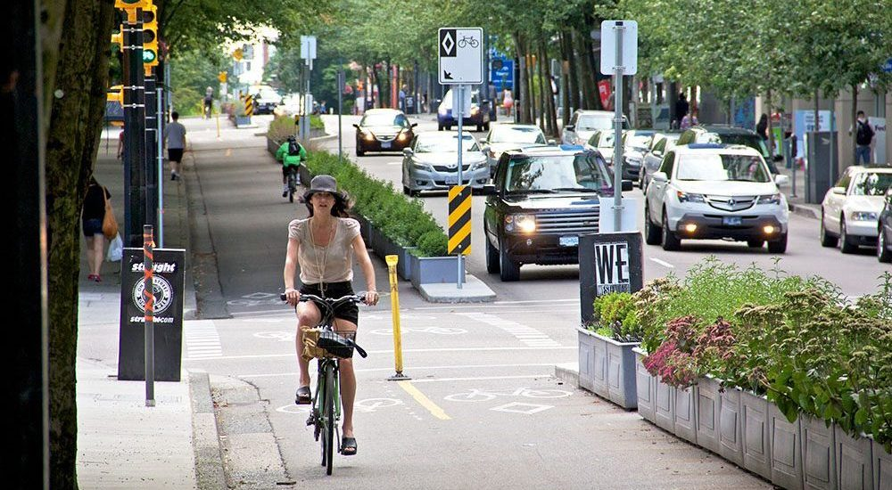
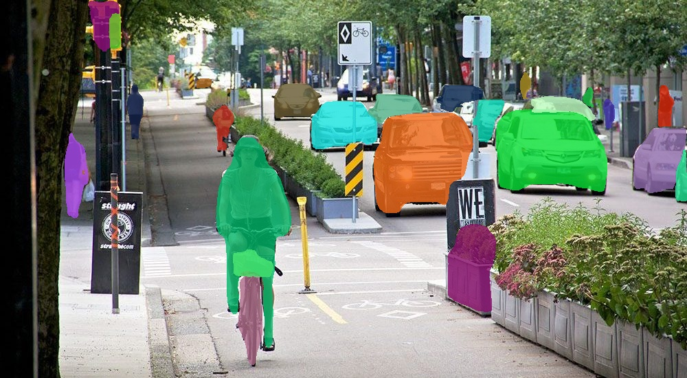
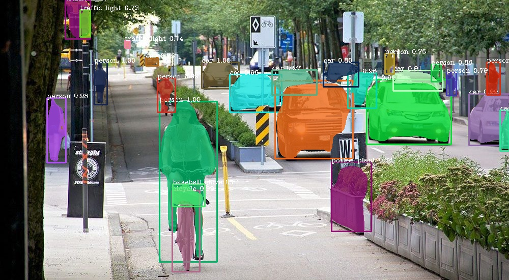
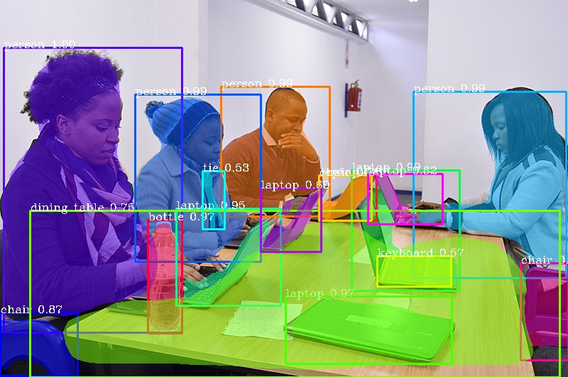
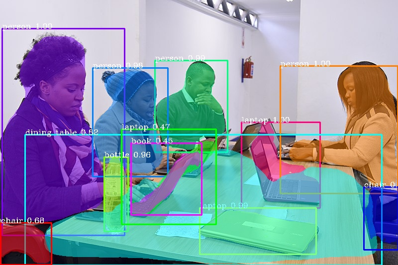
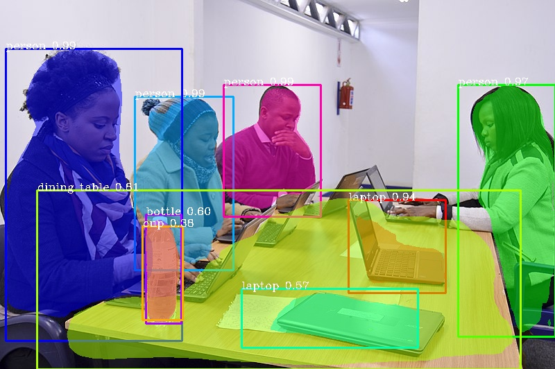

# Instance segmentation of images with PixelLib

Instance segmentation with PixelLib is based on MaskRCNN framework.

Download the mask rcnn model from [here](https://github.com/ayoolaolafenwa/PixelLib/releases/download/1.2/mask_rcnn_coco.h5)

**Code to implement instance segmentation**:

```python

  import pixellib
  from pixellib.instance import instance_segmentation

  segment_image = instance_segmentation()
  segment_image.load_model("mask_rcnn_coco.h5") 
  segment_image.segmentImage("path_to_image", output_image_name = "output_image_path")
```
**Observing each line of code:**

```python

  import pixellib
  from pixellib.instance import instance_segmentation

  segment_image = instance_segmentation()
```
The class for performing instance segmentation is imported and we created an instance of the class.

```python

  segment_image.load_model("mask_rcnn_coco.h5") 
```
This is the code to load the mask rcnn model to perform instance segmentation. 

```python

  segment_image.segmentImage("path_to_image", output_image_name = "output_image_path")
```
This is the code to perform instance segmentation on an image and it takes two parameters:

  **path_to_image**: The path to the image to be predicted by the model.

  **output_image_name**: The path to save the segmentation result. It will be saved in your current working directory.

**Sample2.jpg**




```python

  import pixellib
  from pixellib.instance import instance_segmentation

  segment_image = instance_segmentation()
  segment_image.load_model("mask_rcnn_coco.h5") 
  segment_image.segmentImage("sample2.jpg", output_image_name = "image_new.jpg")
```




This is the saved image in your current working directory. 

You can implement segmentation with bounding boxes. This can be achieved by modifying the code.

```python

  segment_image.segmentImage("sample2.jpg", output_image_name = "image_new.jpg", show_bboxes = True)

```
We added an extra parameter **show_bboxes** and set it to **true**, the segmentation masks are produced with bounding boxes.



You get a saved image with both segmentation masks and bounding boxes.

## Speed Adjustments for Faster Inference
PixelLib now supports the ability to adjust the speed of detection according to a user's needs. The inference speed with a minimal reduction in the accuracy of detection. There are three main parameters that control the speed of detection.

1 **average**

2 **fast**

3 **rapid**

By default the detection speed is about 1 second for a processing a single image.

 <br/> <br/>


**average detection mode**


```python

  import pixellib
  from pixellib.instance import instance_segmentation

  segment_image = instance_segmentation(infer_speed = "average" )
  segment_image.load_model("mask_rcnn_coco.h5") 
  segment_image.segmentImage("sample.jpg", show_bboxes = True, output_image_name = "new.jpg")
```
In the modified code above within the class *instance_segmentation* we introduced a new parameter **infer_speed** which determines the speed of detection and it was set to **average**. The average value reduces the detection to half of its original speed, the detection speed would become *0.5* seconds for processing a single image.

**Output Image** <br/>


 <br/> <br/>

We obtained beautiful results with *average detection speed mode*. <br/> <br/>

**fast detection  mode**
```python

  import pixellib
  from pixellib.instance import instance_segmentation

  segment_image = instance_segmentation(infer_speed = "fast" )
  segment_image.load_model("mask_rcnn_coco.h5") 
  segment_image.segmentImage("sample.jpg", show_bboxes = True, output_image_name = "new.jpg")
```
In the code above we replaced the **infer_speed**  value to **fast** and the speed of detection is about *0.35* seconds for processing a single image. <br/>

**Output Image** <br/>


 <br/> <br/>

Our results are still wonderful with *fast detection speed mode*. <br/> <br/>


**rapid detection mode**
```python

  import pixellib
  from pixellib.instance import instance_segmentation

  segment_image = instance_segmentation(infer_speed = "rapid" )
  segment_image.load_model("mask_rcnn_coco.h5") 
  segment_image.segmentImage("sample.jpg", show_bboxes = True, output_image_name = "new.jpg")
```
In the code above we replaced the **infer_speed**  value to **rapid** which is the fastest detection mode. The speed of detection  becomes 
*0.25* seconds for processing a single image. <br/>


**Output Image** <br/>


 <br/> <br/>

The *rapid detection speed mode* produces good results with the fastest inference speed. <br/> <br/>

**Note** These inference reports are obtained using Nvidia GeForce 1650. <br/> <br/>

**Specialised uses of PixelLib may require you to return the array of the segmentation's output.**

**Obtain the following arrays**:

-Detected Objects' arrays

-Objects' corresponding class_ids' arrays

-Segmentation masks' arrays

-Output's array

By using this code

```python

  segmask, output = segment_image.segmentImage()
```


* You can test the code for obtaining arrays and print out the shape of the output by modifying the instance segmentation code below.

``` python

  import pixellib
  from pixellib.instance import instance_segmentation
  import cv2

  instance_seg = instance_segmentation()
  instance_seg.load_model("mask_rcnn_coco.h5")
  segmask, output = instance_seg.segmentImage("sample2.jpg")
  cv2.imwrite("img.jpg", output)
  print(output.shape)
```

Obtain arrays of segmentation with bounding boxes by including the parameter **show_bboxes**.

```python

  segmask, output = segment_image.segmentImage(show_bboxes = True)

```
* Full code

```python

  import pixellib
  from pixellib.instance import instance_segmentation
  import cv2

  instance_seg = instance_segmentation()
  instance_seg.load_model("mask_rcnn_coco.h5")
  segmask, output = instance_seg.segmentImage("sample2.jpg", show_bboxes= True)
  cv2.imwrite("img.jpg", output)
  print(output.shape)

``` 


# Process opencv's frames 

```python

  import pixellib
  from pixellib.instance import instance_segmentation
  import cv2

  segment_frame = instance_segmentation()
  segment_frame.load_model("mask_rcnn_coco.h5")

  capture = cv2.VideoCapture(0)
  while True:
    ret, frame = capture.read()
    segment_frame.segmentFrame(frame)
    cv2.imshow("frame", frame)
    if  cv2.waitKey(25) & 0xff == ord('q'):
        break
```    
